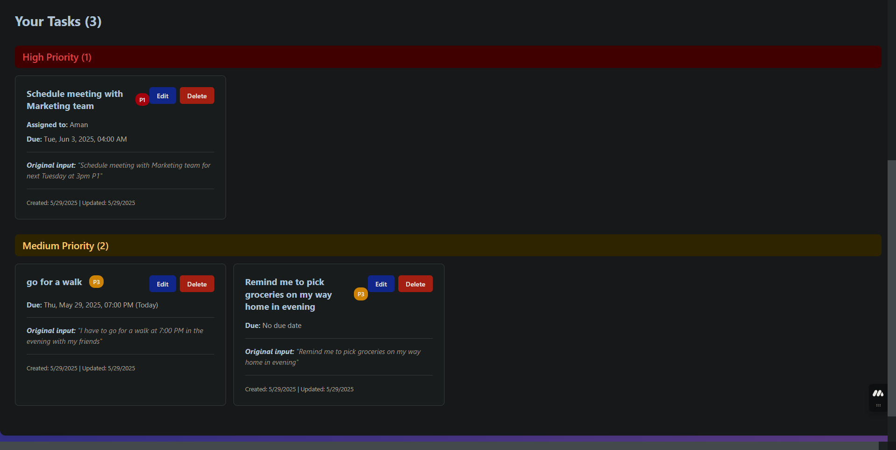
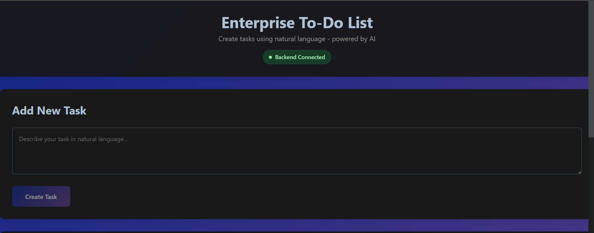

# Enterprise-Grade To-Do List with Natural Language Processing

A modern web application that allows users to input tasks in natural language, automatically parses them using Google's Gemini LLM, and displays them in an organized interface.

## Features

- **Natural Language Input**: Type tasks like "Schedule meeting with Marketing team for next Tuesday at 3pm P1"
- **Intelligent Parsing**: Automatically extracts task name, assignee, due date/time, and priority
- **Modern UI**: Clean, responsive React interface
- **Task Management**: Create, read, update, and delete tasks
- **Real-time Updates**: Instant feedback and updates

## Tech Stack

### Frontend
- **React** with Vite for fast development
- **Axios** for API communication
- **Modern CSS** for styling

### Backend
- **FastAPI** for high-performance API
- **MongoDB** for flexible data storage
- **Google Gemini LLM** for natural language processing
- **Pydantic** for data validation

## Project Structure

```
Enterprise-Grade_To-Do_List/
├── backend/                 # FastAPI backend
│   ├── app/
│   │   ├── main.py         # FastAPI app entry point
│   │   ├── models.py       # Pydantic models
│   │   ├── database.py     # MongoDB connection
│   │   ├── gemini_service.py # LLM integration
│   │   └── routes/
│   │       └── tasks.py    # Task API endpoints
│   ├── requirements.txt
│   └── .env
├── frontend/               # React frontend
│   ├── src/
│   │   ├── components/     # React components
│   │   ├── services/       # API services
│   │   └── App.jsx
│   └── package.json
└── README.md
```

## Setup Instructions

### Prerequisites
- Python 3.8+
- Node.js 16+
- MongoDB Atlas account (or local MongoDB)
- Google AI Studio account for Gemini API

### Backend Setup

1. **Navigate to backend directory**:
   ```bash
   cd backend
   ```

2. **Create and activate virtual environment**:
   ```bash
   python -m venv venv
   # Windows
   venv\Scripts\activate
   # Linux/macOS
   source venv/bin/activate
   ```

3. **Install dependencies**:
   ```bash
   pip install -r requirements.txt
   ```

4. **Configure environment variables**:
   - Copy `.env.example` to `.env`
   - Add your Gemini API key: `GEMINI_API_KEY=your_api_key_here`
   - Add MongoDB URI: `MONGODB_URI=your_mongodb_connection_string`

5. **Run the backend**:
   ```bash
   uvicorn app.main:app --reload
   ```

### Frontend Setup

1. **Navigate to frontend directory**:
   ```bash
   cd frontend
   ```

2. **Install dependencies**:
   ```bash
   npm install
   ```

3. **Start development server**:
   ```bash
   npm run dev
   ```

### Getting API Keys

#### Gemini API Key
1. Go to [Google AI Studio](https://makersuite.google.com/app/apikey)
2. Create a new API key
3. Copy the key to your `.env` file

#### MongoDB Setup
1. Create account at [MongoDB Atlas](https://www.mongodb.com/atlas)
2. Create a free cluster
3. Get connection string and add to `.env` file
4. Whitelist your IP address

## API Endpoints

- `POST /api/tasks/parse` - Parse natural language task input
- `GET /api/tasks` - Get all tasks
- `PUT /api/tasks/{task_id}` - Update a task
- `DELETE /api/tasks/{task_id}` - Delete a task

## Application Screenshots

Here are some screenshots of the application in action:

**Image 1:**


**Image 2:**


## Usage Examples

### Natural Language Input Examples:
- "Schedule meeting with Marketing team for next Tuesday at 3pm P1"
- "Buy groceries tomorrow P2"
- "Complete project report by Friday 5pm assigned to John P1"
- "Call client about proposal next week P3"

The system will automatically extract:
- **Task Name**: The main action to be performed
- **Assignee**: Person responsible (if mentioned)
- **Due Date/Time**: When the task is due
- **Priority**: P1 (highest) to P4 (lowest)

## Development

### Running Tests
```bash
# Backend tests
cd backend
pytest

# Frontend tests
cd frontend
npm test
```

### Building for Production
```bash
# Frontend build
cd frontend
npm run build

# Backend deployment
cd backend
# Use your preferred deployment method (Docker, etc.)
```

## Contributing

1. Fork the repository
2. Create a feature branch
3. Make your changes
4. Add tests
5. Submit a pull request

## License

MIT License - see LICENSE file for details
